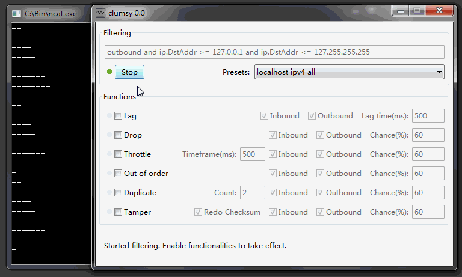

# Clumsy - Network Packet Manipulation Tool

## Overview
Clumsy is a network packet manipulation tool that allows users to simulate various network conditions by intercepting and modifying network traffic in real-time. This version has been significantly enhanced with a modular UI system, improved logging, and enhanced functionality.

## Details

Simulate network latency, delay, packet loss with clumsy on Windows 7/8/10:



## Key Features

### Modular UI System
- Tab-based interface in the top-left corner similar to Windows tabs
- Side panels for automation, logging, and statistics that can be toggled on/off
- Panels open smoothly to the right of the main window
- Clean main window showing only core network manipulation modules

### Enhanced Logging System
- Real-time packet action logging (DROP, RST, MODIFY, etc.)
- Dedicated logging panel with live updates
- Configurable log formats (TEXT, CSV, JSON)

### Improved Statistics
- Comprehensive statistics display with all metrics on a single panel
- Real-time updates for all network manipulation actions
- Detailed tracking of packet modifications

### Network Manipulation Modules
1. **Drop** - Randomly drops packets
2. **Lag** - Delays packets by a specified time
3. **Duplicate** - Creates copies of packets
4. **Tamper** - Modifies packet contents
5. **Reset** - Sends TCP RST packets
6. **Throttle** - Limits packet throughput
7. **Out of Order** - Reorders packets
8. **Bandwidth** - Limits bandwidth
9. **Length Filter** - Filters packets by size with configurable actions
10. **TLS** - TLS/SSL packet manipulation

### Enhanced Length Filter Module
The length filter module has been completely reworked with a dropdown menu that allows users to select what action to take on packets that match the length filter criteria:
- **Pass Through** - Packets matching the filter are passed through without modification
- **Drop** - Packets matching the filter are dropped (discarded)
- **Lag** - Packets matching the filter are delayed using a configurable buffer
- **Duplicate** - Packets matching the filter are duplicated a configurable number of times

### Optimized UI Layout
- Compact layout for all module controls to prevent window widening
- Shortened labels and reduced input field sizes for better space utilization
- Efficient control arrangement without unused space after module names
- Consistent design across all modules with "In"/"Out" direction toggles
- **Natural Flow Layout**: Controls appear immediately after module names without unnecessary spacing
- **Dynamic Resizing**: Window adjusts properly when modules are enabled/disabled
- **Responsive Design**: Controls wrap to new lines when window is too narrow

## Technical Implementation

### Architecture
- Built with IUP 3.30 GUI framework for cross-platform interface
- Uses WinDivert 2.2.0 for network packet interception
- Written in C with Zig 0.10.1 build system targeting x86_64-windows-gnu
- Modular architecture with function pointers for easy extension

### Core Components
- **Main Application** - Central coordination and UI management
- **Divert Module** - Packet interception and injection using WinDivert
- **Module System** - Pluggable architecture for network manipulation functions
- **Logging System** - Real-time packet action logging and display
- **Statistics System** - Comprehensive metrics tracking
- **UI Components** - Interactive controls for all modules

### Build System
```bash
# Build with Zig (from project root)
zig build -Darch=x64 -Dconf=Release -Dsign=A
```

## Configuration
The application can be configured through:
1. **UI Controls** - Interactive sliders, checkboxes, and inputs for each module
2. **Parameterized Mode** - Command-line parameters for automated testing
3. **Config Files** - Persistent settings storage

## Usage
1. Run the application as Administrator (required for packet interception)
2. Configure the desired network manipulation modules
3. Click "Start" to begin packet interception
4. Monitor logs and statistics in real-time
5. Click "Stop" to end the session

## Module Reference Guide

### Network Manipulation Modules

#### 1. **Drop** - Random Packet Loss
Randomly discards packets to simulate unreliable network conditions.
```
Controls: In/Out, Chance (%)
Usage: Drop 5% of packets to simulate lossy network
Example: In/Out enabled, Chance 5.0%
```

#### 2. **Lag** - Packet Delay
Delays packets by a specified time to simulate latency.
```
Controls: In/Out, Time (ms)
Usage: Add 100ms delay to all packets
Example: In/Out enabled, Time 100ms
```

#### 3. **Duplicate** - Packet Cloning
Creates multiple copies of each packet.
```
Controls: In/Out, Copies (count)
Usage: Duplicate packets 3 times to test TCP retransmission
Example: In/Out enabled, Copies 3
```

#### 4. **Throttle** - Bandwidth Limiting
Limits packet throughput to simulate bandwidth constraints.
```
Controls: In/Out, Timeframe (ms), Chance (%)
Usage: Throttle to 100 packets per 1000ms
Example: In/Out enabled, Timeframe 1000ms, Chance 10%
```

#### 5. **Out of Order (OOD)** - Reorder Packets
Reorders packets in the stream to simulate network disorder.
```
Controls: In/Out, Duplicates (count)
Usage: Test TCP sequence number handling
Example: In/Out enabled, Duplicates 2
```

#### 6. **Tamper** - Packet Modification
Modifies packet contents (headers/payload).
```
Controls: In/Out, Chance (%), Type (Checksum/Injection/Shuffle)
Usage: Corrupt packet data to test error handling
Example: In/Out enabled, Chance 5%, Type Checksum
```

#### 7. **Reset (RST)** - TCP Connection Termination
Sends TCP RST packets to abruptly terminate connections.
```
Controls: In/Out, Probability (%)
Usage: Force connection resets
Example: In/Out enabled, Probability 1%
```

#### 8. **Bandwidth** - Traffic Rate Control
Limits overall network bandwidth for all traffic.
```
Controls: In/Out, Limit (Mbps)
Usage: Limit bandwidth to 1Mbps
Example: In/Out enabled, Limit 1.0 Mbps
```

#### 9. **Length Filter** - Size-Based Actions ⭐ NEW
Applies different actions based on packet size. Supports 6 action types with configurable parameters.
```
Controls: In/Out, Min-Max size (bytes), Action, Lag (ms), Dup (count)
Actions: Nothing | Drop | Lag | Duplicate | Reset | Out of Order

Example 1 - Drop Large Packets:
  Min: 1400, Max: 1500, Action: Drop
  Effect: All packets 1400-1500 bytes are discarded

Example 2 - Lag Small Packets:
  Min: 64, Max: 256, Action: Lag, Lag: 100ms
  Effect: Packets 64-256 bytes delayed by 100ms

Example 3 - Duplicate Medium Packets:
  Min: 500, Max: 999, Action: Duplicate, Dup: 2
  Effect: Packets 500-999 bytes are sent twice

Example 4 - Pass Non-Standard Sizes:
  Min: 1460, Max: 1461, Action: Nothing (IPv6 jumbo frames pass through)
```

#### 10. **TLS** - HTTPS/SSL Manipulation ⭐ ENHANCED
Targets encrypted traffic with intelligent packet type detection.
```
Controls: In/Out, Seq Aware, Handshake (%), Data Loss (%), Delay (ms)

What it does:
  - Identifies TLS packets on ports 443, 8443, 993, 995
  - Distinguishes HANDSHAKE packets (connection setup) vs DATA packets
  - Applies different loss rates to each type

Example 1 - Robust Handshake:
  Handshake: 98%, Data Loss: 5%, Delay: 200ms
  Effect: Protect handshake (drop 2%), lose 5% of user data, add latency

Example 2 - Stress Test Server:
  Handshake: 50%, Data Loss: 10%, Delay: 100ms
  Effect: Drop 50% of handshakes (connection failures), lose data

Example 3 - Mobile Simulation:
  Handshake: 95%, Data Loss: 8%, Delay: 300ms
  Effect: Simulate mobile network (spotty HTTPS connections)
```

### Hidden Modules (Advanced)

#### **Logs** - Real-Time Event Logging
Displays all packet modifications with timestamps and packet details.
```
Features:
  - Live packet action tracking (DROP, LAG, DUPLICATE, etc.)
  - Configurable formats: TEXT, CSV, JSON
  - Export capabilities for analysis
Toggle: Click "Logs" in Panels
```

#### **Stats** - Network Statistics
Comprehensive metrics for all ongoing network manipulations.
```
Displays:
  - Total packets processed
  - Packets modified per module
  - Current bandwidth usage
  - Connection statistics
Toggle: Click "Stats" in Panels
```

#### **Auto** - Automation & Scripting
Run automated test scenarios with predefined scripts.
```
Features:
  - Pre-built templates: Stress Test, Mobile Sim, TLS Test, Packet Analysis
  - Custom scripting language
  - Scheduled/repeated execution

Script Commands:
  wait <ms>              - Wait N milliseconds
  enable <module>        - Turn on module
  disable <module>       - Turn off module
  set <module> <param> <value>  - Configure parameter
  profile <name>         - Apply profile (3G/4G/WiFi)
  log <message>          - Log message
  export data            - Export results

Example Script:
  wait 2000
  enable drop
  set drop chance 10.0
  wait 30000
  disable drop
  log "Stress test complete"
Toggle: Click "Auto" in Panels
```

## Real-World Usage Scenarios

### Scenario 1: Test Web App on 3G Network
**Goal:** Verify app stability on slow, lossy connection
```
1. Enable Drop: In/Out, Chance 10%
2. Enable Lag: In/Out, Time 200ms
3. Enable Throttle: In/Out, Timeframe 1000ms, Chance 20%
4. Visit website - observe loading, responsiveness
5. Check logs for packet drops and delays
```

### Scenario 2: Stress Test HTTPS Server
**Goal:** Find breaking point of TLS connections
```
1. Enable TLS: In/Out, Handshake 80%, Data Loss 5%
2. Enable Auto with "TLS Connection Test" script
3. Monitor Stats panel for connection failures
4. Increase packet loss gradually until server recovers
5. Export results from Auto panel
```

### Scenario 3: Debug Large File Transfer
**Goal:** Test handling of jumbo packets
```
1. Enable Length: Min 1400, Max 1500, Action Drop
2. Attempt file transfer
3. Monitor if transfer fails/succeeds
4. Change Action to Lag (100ms) to see latency impact
5. Check logs for packet size distribution
```

### Scenario 4: Mobile Network Simulation
**Goal:** Test app behavior on mobile
```
1. Enable Lag: In/Out, Time 100-300ms
2. Enable Drop: In/Out, Chance 5-15%
3. Enable Throttle: In/Out, Limit 2-5 Mbps
4. Or use Auto: "Mobile Simulation" script for realistic patterns
```

### Scenario 5: Out-of-Order Packet Test
**Goal:** Verify TCP sequence number handling
```
1. Enable OOD: In/Out, Duplicates 3
2. Stream video/download file
3. Check if app detects corruption
4. Compare with Drop module (shows difference in handling)
```

## Requirements
- Windows Vista/2008 or later (x86/x64)
- Administrator privileges
- WinDivert driver (included)

## License
See [LICENSE](LICENSE) file for details.