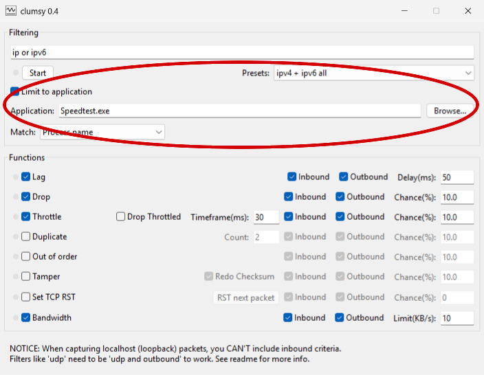

# clumsy 0.4

__clumsy makes your network condition on Windows significantly worse, but in a managed and interactive manner.__

clumsy uses [WinDivert](https://reqrypt.org/windivert.html) to capture live packets, apply impairments such as lag, drop, throttle, duplicate, tamper, reset, and bandwidth limits, then reinject the packets. It is useful for testing applications under poor network conditions without changing application code or setting up a proxy.

Version 0.4 adds native application-level filtering. You can now limit clumsy's impairments to traffic owned by a selected executable while unrelated traffic passes through normally.

## Download

- [Download clumsy 0.4 for Windows x64](https://github.com/foodak/clumsy/releases/download/v0.4/clumsy-0.4-win64.zip)
- [View all releases](https://github.com/foodak/clumsy/releases)

clumsy must be run as Administrator because it uses WinDivert to intercept packets.

## What's New In 0.4

- Native "Limit to application" controls in the Filtering panel.
- Process-name matching, for example `Game.exe` or `Speedtest.exe`.
- Full-path matching with a Browse button for exact executable selection.
- Multiple targets separated with commas or semicolons.
- Child-process matching for launchers and portable apps, such as `SpeedtestPortable.exe` launching `Speedtest.exe`.
- WinDivert FLOW tracking plus IP Helper seeding so existing and newly opened TCP/UDP flows can be attributed to process IDs.
- Target-aware packet capture that narrows the NETWORK-layer filter to known target TCP/UDP ports when the app filter is enabled.
- Live status counters for target PIDs, target flows, UDP endpoints, affected packets, passed packets, and unknown packets.

## Application Filter Preview

## Quick Start

1. Run clumsy as Administrator.
2. Choose a packet filter, for example `outbound and (tcp or udp)`.
3. Enable the impairment modules you want, such as lag, drop, throttle, or bandwidth.
4. Optional: check "Limit to application".
5. Enter an executable name such as `Speedtest.exe`, or use Browse to select a full path.
6. Click Start.

When the application filter is disabled, clumsy keeps its original system-wide behavior.

## Application Filter

The application filter is built for the common case where you want to test one app without disrupting debuggers, calls, browsers, or other unrelated network activity.

The normal packet filter still controls which traffic clumsy is allowed to capture. When "Limit to application" is enabled, clumsy only applies impairments to TCP/UDP packets attributed to the selected executable name or full path. Non-target and unknown packets are passed through unchanged.

Example:

- Packet filter: `outbound and (tcp or udp)`
- Application: `Speedtest.exe`

Notes:

- Process-name matching is case-insensitive.
- In process-name mode, `game` also matches `game.exe`.
- Browse fills in a full executable path and switches matching to full-path mode.
- Multiple applications can be separated with commas or semicolons.
- Child-process matching is enabled, which helps launchers and portable apps.
- The target app does not need to be running before clumsy starts.
- Unknown or unattributed packets pass through unchanged by design.
- Loopback attribution has the same caveats as clumsy's existing loopback support.

## Details

clumsy supports latency, delay, packet loss, throttling, packet duplication, out-of-order delivery, tampering, connection reset, and bandwidth limiting on Windows.

## License

MIT
